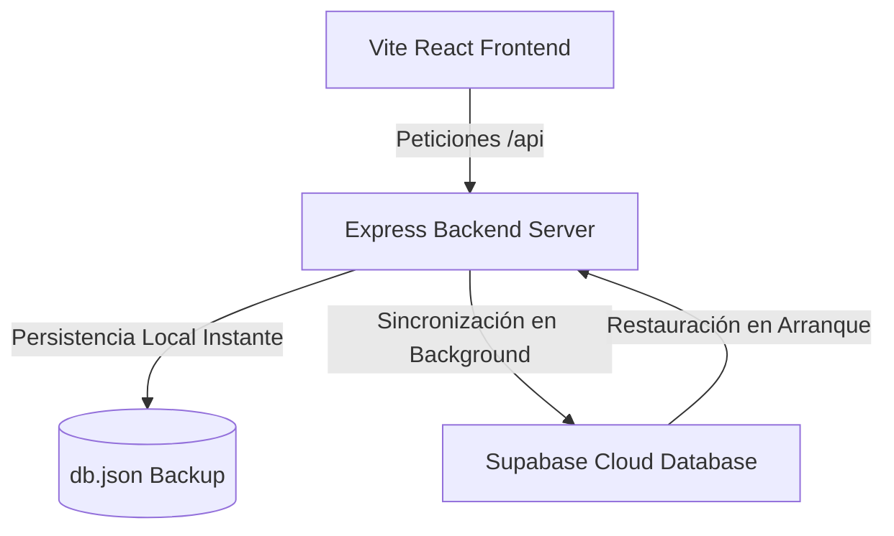

# ⚡ Command Center OS (v2) — Cloud Deployment & Synchronization Guide

Bienvenido al panel de control unificado **Command Center OS**. Esta versión incluye sincronización bidireccional en tiempo real entre tu almacenamiento local y la nube de **Supabase**, además de estar 100% optimizado para un despliegue en un único servicio web en **Render**.

---

## 🏗️ Arquitectura de Sincronización en la Nube
El sistema utiliza un diseño híbrido altamente eficiente:
*   **Local (Persistencia Rápida):** Las escrituras y lecturas ocurren instantáneamente en tu archivo local `db.json` para máxima velocidad.
*   **Supabase (Espejo en la Nube):** En segundo plano, cada cambio se sincroniza de forma asíncrona hacia Supabase. Al arrancar o reiniciarse el servidor en Render, el backend descarga automáticamente el último estado guardado en la nube para reconstruir el entorno de forma fluida.



---

## 🛠️ PASO 1: Configuración de Supabase
Para persistir tus eventos, checklist, notas y tareas en la nube de forma segura:

1. Ve a [Supabase](https://supabase.com/) y crea un proyecto nuevo (Gratuito).
2. Entra en el panel de tu proyecto y dirígete al **SQL Editor** (menú lateral izquierdo).
3. Pega y ejecuta el siguiente bloque SQL para crear la tabla de sincronización y sus políticas de seguridad:

```sql
-- 1. Crear tabla para el estado unificado del Command Center
CREATE TABLE IF NOT EXISTS command_center_state (
    id BIGINT PRIMARY KEY,
    data JSONB NOT NULL DEFAULT '{}'::jsonb,
    updated_at TIMESTAMP WITH TIME ZONE DEFAULT TIMEZONE('utc'::text, NOW()) NOT NULL
);

-- 2. Habilitar seguridad de nivel de fila (Row Level Security)
ALTER TABLE command_center_state ENABLE ROW LEVEL SECURITY;

-- 3. Crear política para permitir lectura y escritura desde nuestra API
CREATE POLICY "Permitir operaciones completas"
ON command_center_state
FOR ALL
USING (true)
WITH CHECK (true);
```

4. Ve a la pestaña **Project Settings** > **API** y copia los siguientes valores:
   *   `Project URL` (ej. `https://xxxxxx.supabase.co`)
   *   `service_role` key (o la `anon` key) para el acceso API.

---

## 🐙 PASO 2: Subir tu Código a GitHub
Hemos configurado un archivo `.gitignore` robusto que protege tus secretos locales (`.env`), registros y bases de datos locales. Sigue estos pasos para subir tu código de forma segura:

1. Abre tu terminal en la carpeta raíz del proyecto (`events-dashboard-v2`):
   ```bash
   # 1. Inicializar el repositorio Git
   git init

   # 2. Agregar todos los archivos (ignora automáticamente archivos pesados y secretos)
   git add .

   # 3. Hacer tu primer commit de producción
   git commit -m "feat: setup cloud-ready command center with Supabase Sync"
   ```

2. Crea un nuevo repositorio en tu cuenta de **GitHub** (puede ser Privado).
3. Vincula tu repositorio local con GitHub y sube tu código:
   ```bash
   # Vincula tu repositorio remoto (Reemplaza con tu enlace de GitHub)
   git remote add origin https://github.com/tu-usuario/nombre-del-repo.git
   
   # Renombra la rama principal e impulsa el código
   git branch -M main
   git push -u origin main
   ```

---

## 🚀 PASO 3: Desplegar en Render
**Render** permite desplegar tanto el frontend como el backend juntos de forma 100% gratuita y en un solo servicio:

1. Ve al panel de control de [Render](https://render.com/) e inicia sesión con tu cuenta de GitHub.
2. Haz clic en **New** > **Web Service**.
3. Selecciona el repositorio de GitHub que acabas de subir.
4. Configura los siguientes parámetros en el formulario de creación:
   *   **Name:** `command-center-os`
   *   **Environment / Runtime:** `Node`
   *   **Branch:** `main`
   *   **Region:** (Elige la más cercana a ti, ej. *Oregon* o *Frankfurt*)
   *   **Build Command:**
       ```bash
       npm install && npm run build
       ```
   *   **Start Command:**
       ```bash
       npm run server
       ```

5. Desplázate hacia abajo y abre la sección **Environment Variables** (Variables de Entorno). Agrega las siguientes variables:

   | Clave | Valor | Descripción |
   | :--- | :--- | :--- |
   | `SUPABASE_URL` | *Tu Project URL de Supabase* | Dirección de tu base de datos en la nube. |
   | `SUPABASE_KEY` | *Tu Supabase Anon/Service Key* | Clave de acceso a la API. |
   | `PORT` | `3002` | Puerto en el que corre Express (Render lo inyecta, pero es buena práctica declararlo). |
   | `NODE_ENV` | `production` | Indica el modo de ejecución. |

6. Haz clic en **Create Web Service**. ¡Render comenzará a compilar e instalar tu aplicación!

---

## 💡 Verificación de Funcionamiento
Una vez finalizado el despliegue de Render:
1. Render te proporcionará un enlace público (ej. `https://command-center-os.onrender.com`).
2. Abre la URL en tu navegador: verás tu espectacular Command Center cargarse con un rendimiento ultrasónico.
3. Abre el panel lateral **Cloud Sync & Telemetry** (desde el icono en el Topbar):
   *   Verás el indicador en verde: **`CONNECTED`**.
   *   ¡Presiona **Push to Cloud** para subir tus primeros eventos locales!
   *   Cualquier actualización que realices en el dashboard se reflejará en tiempo real e instantáneamente en la nube de Supabase.

---

*Desarrollado con pasión para una gestión impecable de eventos y crecimiento operativo. ⚡*
